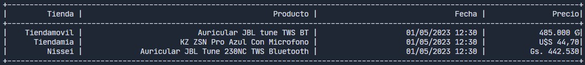

# Shops Scraper

This script make scrapping of a list of products in differten websites according to sites.json file



## Requirements
- Python 3
- pip3
- virtualenv

## Setup

### Create Virtual env
```bash
virtualenv env
```

### Activate env
```bash
source ./env/bin/activate
```


### Install requirements
```bash
pip install -r requirement.txt
```


## Run script
```bash
python main.py
```